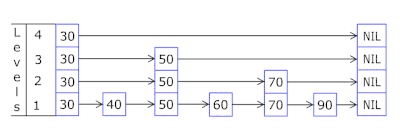

## Array LinkedList SkipList

### Array

In [computer science](https://en.wikipedia.org/wiki/Computer_science), an **array data structure**, or simply an **array**, is a [data structure](https://en.wikipedia.org/wiki/Data_structure) consisting of a collection of *elements* ([values](https://en.wikipedia.org/wiki/Value_(computer_science)) or [variables](https://en.wikipedia.org/wiki/Variable_(programming))), each identified by at least one *array index* or *key*. An array is stored such that the position of each element can be computed from its index [tuple](https://en.wikipedia.org/wiki/Tuple) by a mathematical formula. The simplest type of data structure is a linear array, also called one-dimensional array.[Wikipedia]

Array is stored consecutively in memory. So one requires to provide the length of the array. The memory controller would spend O(1) time to assign memory to the array. The length of the array could not be modified. (Java ArrayList create a new underlying array after the list is full)

| Operation | Cost | Notes                                                        |
| --------- | ---- | ------------------------------------------------------------ |
| lookup    | O(1) | lookup the ith  base addresses + i * data type size random access |
| insertion | O(n) | move all elements after inseration point by 1 (+1)           |
| deletion  | O(n) | move all elements after deletion point by 1 (-1)             |

### LinkedList

In [computer science](https://en.wikipedia.org/wiki/Computer_science), a **linked list** is a linear collection of data elements whose order is not given by their physical placement in memory. Instead, each element [points](https://en.wikipedia.org/wiki/Pointer_(computer_programming)) to the next. It is a [data structure](https://en.wikipedia.org/wiki/Data_structure) consisting of a collection of [nodes](https://en.wikipedia.org/wiki/Node_(computer_science)) which together represent a [sequence](https://en.wikipedia.org/wiki/Sequence). In its most basic form, each node contains: [data](https://en.wikipedia.org/wiki/Data_(computing)), and a [reference](https://en.wikipedia.org/wiki/Reference_(computer_science)) (in other words, a *link*) to the next node in the sequence. This structure allows for efficient insertion or removal of elements from any position in the sequence during iteration. More complex variants add additional links, allowing more efficient insertion or removal of nodes at arbitrary positions. A drawback of linked lists is that access time is linear (and difficult to [pipeline](https://en.wikipedia.org/wiki/Instruction_pipelining)). Faster access, such as random access, is not feasible. [Arrays](https://en.wikipedia.org/wiki/Array_data_structure) have better [cache locality](https://en.wikipedia.org/wiki/Locality_of_reference) compared to linked lists. [Wikipedia]

| Operation | Cost | Notes                                                        |
| --------- | ---- | ------------------------------------------------------------ |
| lookup    | O(n) | have to iterate over the list to find ith element            |
| insertion | O(1) | make the origin node point to it and it point to the origin node previous next |
| deletion  | O(1) | make the parent node point to its next.                      |

### SkipList

In [computer science](https://en.wikipedia.org/wiki/Computer_science), a **skip list** is a [probabilistic](https://en.wikipedia.org/wiki/Randomized_algorithm) [data structure](https://en.wikipedia.org/wiki/Data_structure) that allows {\displaystyle {\mathcal {O}}(\log n)} search complexity as well as {\displaystyle {\mathcal {O}}(\log n)} insertion complexity within an [ordered sequence](https://en.wikipedia.org/wiki/Ordered_sequence) of {\displaystyle n} elements. Thus, it can get the best features of a sorted [array](https://en.wikipedia.org/wiki/Array_data_structure) (for searching) while maintaining a [linked list](https://en.wikipedia.org/wiki/Linked_list)-like structure that allows insertion, which is not possible in an array. Fast search is made possible by maintaining a linked hierarchy of subsequences, with each successive subsequence skipping over fewer elements than the previous one (see the picture below on the right). Searching starts in the sparsest subsequence until two consecutive elements have been found, one smaller and one larger than or equal to the element searched for. Via the linked hierarchy, these two elements link to elements of the next sparsest subsequence, where searching is continued until finally we are searching in the full sequence. The elements that are skipped over may be chosen probabilistically or deterministically, with the former being more common.[Wikipedia]

SkipList improve lookup performance of LinkedList. 

Idea: Space-time/time-memory trade off. Add levels of indices to on top of LinkedList.

Well known Application -> Redis

Number of level of indices -> log(n)

| Operation | Cost      | Notes                                                    |
| --------- | --------- | -------------------------------------------------------- |
| lookup    | O(log(n)) | Cut half of the searching range with each level of index |
| insertion | O(log(n)) | It requires to update the index after inseration         |
| deletion  | O(log(n)) | Similarly, index should be updated                       |

