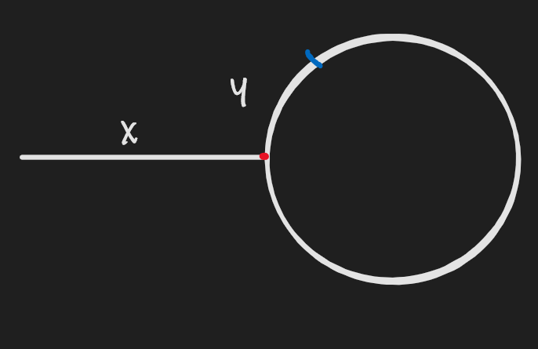

## Linked List

Linked List does not support random access. It has to be iterated to the targeted index. which leads to O(n) lookup. But it does not require consecutive memory space. Two common kinds of Linked List are singly linked list and doubly linked list. Singly linked list only contains a pointer to its next and doubly linked list contains both pointers to its previous node and its next node.  Common operations like iterate over the linked list.

### Reverse Linked List

[Link](https://leetcode.com/problems/reverse-linked-list/)

Given the head of a singly linked list, reverse the list.

There is nothing special here. It just requires to iterate over the link and put the node in the head every time.

```java
/**
 * Definition for singly-linked list.
 * public class ListNode {
 *     int val;
 *     ListNode next;
 *     ListNode() {}
 *     ListNode(int val) { this.val = val; }
 *     ListNode(int val, ListNode next) { this.val = val; this.next = next; }
 * }
 */
class Solution {
    public ListNode reverseList(ListNode head) {
        ListNode pre = null;
        ListNode cur = head;
        while (cur != null) {
            var temp = cur.next;
            cur.next = pre;
            pre = cur;
            cur = temp;
        }
        return pre;
    }
}
```

Time complexity: O(n);

Space Complexity: O(1)

For Linked List related problem, a common technique is to have a sentinel node. That is usually a node is added as previous node of the head. Such node help to consider the case null, empty, last node etc. .

```java
    public ListNode reverseList(ListNode head) {
        ListNode dummy = new ListNode();
        while (head != null) {
            var temp = head.next;
            head.next = dummy.next;
            dummy.next = head;
            head = temp;
        }
        
        return dummy.next;
    }
```

Time complexity: O(n)

Space complexity: O(1)

### Swap Nodes in Pairs

[Link](https://leetcode.com/problems/swap-nodes-in-pairs/)

Swap every two adjacent nodes in a singly linked list. Note. one should not change the value of a node.

It is troublesome if sentinel node is not used in the solution.  In the beginning, one would deal with empty list, one element, two elements before moving to the rest. With sentinel node, this would be simplified.

```java
    public ListNode swapPairs(ListNode head) {
        ListNode dummy = new ListNode();
        dummy.next = head;
        ListNode pre = dummy;
        while (pre.next != null && pre.next.next != null) {
            ListNode cur = pre.next;
            pre.next = cur.next;
            cur.next = cur.next.next;
            pre.next.next = cur;
            pre = cur; 
        } 
        return dummy.next;
    }
```

Time complexity: O(n)

Space complexity: O(1)

### Linked List Cycle

[Link](https://leetcode.com/problems/linked-list-cycle/)

Determine if a linked list has a cycle in it.


This is a classic linked list question. Intuitively, one might think about a hashset for the visited node and check if newly arrived node in the set. That solution works but requires O(n) extra space. Is there a solution with O(1) extra space? It comes to the fast and slow pointer technique. Every step, the fast pointer travels two node and the slow pointer travels one node.  If there is a cycle, the two pointer would met. If not, the fast pointer would be null. This solution does not require extra space and time to compute the hashcode. 

```java
    public boolean hasCycle(ListNode head) {
        ListNode slow = head;
        ListNode fast = head;
        while (fast != null && fast.next != null) {
            fast = fast.next.next;
            slow = slow.next;
            if (fast == slow) {
                return true;
            }
        }
        return false;
    }
```

Time complexity: O(n)

Space Complexity: O(1)

### Linked List Cycle II

[Link](https://leetcode.com/problems/linked-list-cycle-ii/)

The same as previous question but return the node where the cycle begins. return null if there no cycles.


Similar to previous question, this can be resolved with set and one pointer.  The answer is one the pointer reach the a met node or null. However, a two pointer solution with O(1) extra space is available.

The solution is still slow and fast pointer



Let us assume the non-cycle part contains x nodes and the slow pointer travels y node on the cycle until met the fast node.

The fast node travels x + y + nC where C is the Circumference and n >= 1. 

The slow node  travels x + y. Also the fast node travels 2 times of what the slow node traveled.

2(x + y) = x + y + nC

x + y = nC

x = nC - y.

If a pointer travels from the head and other travels at the where slow and fast one node each time, they would met at the beginning of the cycle. That is because x = nC - y. When the node starts from the head reach the beginning of the cycle, it travels x. The node from where slow and fast met is also travels x. One the cycle, the latter pointer is at y from the beginning of the cycle. So y + nC - y = nC. It is also at the beginning of the cycle.  

```java
    public ListNode detectCycle(ListNode head) {
        ListNode slow = head;
        ListNode fast = head;
        while (fast != null && fast.next != null) {
            slow = slow.next;
            fast = fast.next.next;
            if (slow == fast) {
                break;
            }
        }
        // if no cycle
        if (fast == null || fast.next == null) {
            return null;
        }
        slow = head;
        while (slow != fast) {
            slow = slow.next;
            fast = fast.next;
        }
        return slow;
    }
```

Time complexity: Two loop n + n => O(n)

Space complexity: O(1)

This is not the answer because the array should not be copied. But this would help us to think other solutions.

### Reverse Nodes in k-Group

[Link](https://leetcode.com/problems/reverse-nodes-in-k-group/)

Reverse every k nodes in a linked list. If the number of left-out nodes is less than k, keep those left-out nodes untouched. 

1. Iterate over the linked list
2. check if there are k nodes left
3. If yes, reverse them. Otherwise break;

The reverse part is the same as reverse linked list solution. But the dummy node should be point to the head of next k node instead of using null.

```java
    public ListNode reverseKGroup(ListNode head, int k) {
        if (k == 1) {
            return head;
        }
        ListNode dummy = new ListNode();
        dummy.next = head;
        ListNode prev = dummy;
        while (prev != null) {
            ListNode end = prev;
            for (int i = 0; i < k; ++i) {
                if (end == null) {
                    break;
                }
                end = end.next;
            }
            if (end == null) {
                break;
            }            
            prev = reverse(prev, end);
        }
        return dummy.next;
    }
    
    private ListNode reverse(ListNode prev, ListNode end) {
        ListNode res = prev.next;
        end = end.next;
        prev.next = end;
        ListNode cur = res;
        while (cur != end) {
            ListNode temp = cur.next;
            cur.next = prev.next;
            prev.next = cur;
            cur = temp;
        }
        return res;
    }
```

Time complexity:  O(n)

Space complexity: O(1)

### Merge Two Sorted Lists

[Link](https://leetcode.com/problems/merge-two-sorted-lists/)

Merge two sorted lists into one sorted list.

#### Iteration

To merge two sorted list, just pick the smaller node from the head of the two lists and move that head to its next node. The troublesome part is the first node. We need to think about both ListNodes are  null, one of them is null and none of them is null. Again, the sentinel node helps to reduce those boilerplate code to make sure it starts as if both of them are none. If creation of a dummy node is neglectable, it is the reasonable price to pay. This technique would also be used in other cases, for example in dynamic programming, it can add an additional row and/or col for the initial cases.

```java
    public ListNode mergeTwoLists(ListNode l1, ListNode l2) {
        ListNode dummy = new ListNode();
        ListNode cur = dummy;
        while (l1 != null && l2 != null ){
            if (l1.val < l2.val) {
                cur.next = l1;
                l1 = l1.next;
            } else {
                cur.next = l2;
                l2 = l2.next;
            }
            cur = cur.next;
        }
        if (l1 != null) {
            cur.next = l1;
        }
        if (l2 != null) {
            cur.next = l2;
        }
        return dummy.next;
    }
```

Time complexity: O(n)

Space complexity: O(1)

#### Recursion

recursion basically does the same thing as the iteration. We only need consider the current non-null node and check the current head. move the head to its next and call the function recursively.

```java
    public ListNode mergeTwoLists(ListNode l1, ListNode l2) {
        if (l1 == null && l2 == null) {
            return null;
        }
        if (l1 == null) {
            return l2;
        }
        if (l2 == null) {
            return l1;
        }
        
        if (l1.val < l2.val) {
            l1.next = mergeTwoLists(l1.next, l2);
            return l1;
        }
        l2.next = mergeTwoLists(l1, l2.next);
        return l2;
    }
```

Time complexity: O(n) where n is the sum of both lengths

Space complexity: O(1) in each recursive call and the max depth is the sum of both lengths (take one for each list and they have the same number of nodes) -> O(n)


