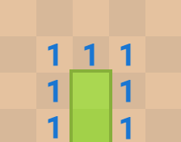

## Number of Islands

[Link](https://leetcode.com/problems/number-of-islands/)

Given an m*n 2D binary grid which represents a map of `1`'s (land) and `0`'s (water), return the number of islands.

An **island** is surrounded by water and is formed by connecting adjacent lands horizontally or vertically. You may assume all four edges of the grid are all surrounded by water.

 ### Solution

This question can be solved by DFS. We just just count the `1` and for every `1` encountered, it and its connected 'lands' would be marked as another character so that we do not need to count one land more than once.

```java
    private static final int[][] DIRS = {{1,0},{-1,0},{,1},{0,-1}};
    public int numIslands(char[][] grid) {
        final int N = grid.length;
        final int M = grid[0].length;
        int res = 0;
        for (int i = 0; i < N; ++i) {
            for (int j = 0; j < M; ++j) {
                // count for '1'
                if (grid[i][j] == '1') {
                    res++;
                    //mark everything in the current land as "counted"
                    dfs(grid,i,j);
                }
            }
        }
        return res;
    }
    
    private void dfs(char[][] grid, int i, int j) {
        if (i < 0 || i >= grid.length || j < 0 || j >= grid[i].length || grid[i][j] != '1') {
            return;
        } 
        // some people mark it as '0'. Here it is marked as '2'. In that case, we can reconstruct the original input
        // of course it could be '0' if you do not want use other characters but it won't be recovered
        // any other char is fine. if you want to test grid[i][j] < '1' instead of grid[i][j] != '1' in previous checking
        // this could be (int) ('0' - 1), i.e. '/'.
        grid[i][j] = '2';
        
        for (int[] dir : DIRS) {
            dfs(grid,i+dir[0], j+dir[1]);
        }
    }
```

Time complexity: It at most visit all cell twice O(nm) where n is the # of row and m is # of column

Space complexity: The max depth of the recursive calls are still all nodes O(nm) 

## Minesweeper

[Link](https://leetcode.com/problems/minesweeper/)

Let's play the minesweeper game ([Wikipedia](https://en.wikipedia.org/wiki/Minesweeper_(video_game)), [online game](http://minesweeperonline.com/))!

You are given an `m x n` char matrix `board` representing the game board where:

- `'M'` represents an unrevealed mine,
- `'E'` represents an unrevealed empty square,
- `'B'` represents a revealed blank square that has no adjacent mines (i.e., above, below, left, right, and all 4 diagonals),
- digit (`'1'` to `'8'`) represents how many mines are adjacent to this revealed square, and
- `'X'` represents a revealed mine.

You are also given an integer array `click` where `click = [clickr, clickc]` represents the next click position among all the unrevealed squares (`'M'` or `'E'`).

Return *the board after revealing this position according to the following rules*:

1. If a mine `'M'` is revealed, then the game is over. You should change it to `'X'`.
2. If an empty square `'E'` with no adjacent mines is revealed, then change it to a revealed blank `'B'` and all of its adjacent unrevealed squares should be revealed recursively.
3. If an empty square `'E'` with at least one adjacent mine is revealed, then change it to a digit (`'1'` to `'8'`) representing the number of adjacent mines.
4. Return the board when no more squares will be revealed.

### Solution

This question is similar to "Number of Islands". But it only starts with a specific location, i.e. (clickr,clickc), whereas, the other problem need to explore all the islands in the board. Also, it would check above, below, left, right and all 4 diagonals. So it requires 8 directions while the other only checks 4 directions. But the idea is the same, we can apply DFS. If the (clickr,clickc) is an unrevealed mine, we should change it to 'X' and stop. Otherwise, we should change 'E' to either 'B' or a digit. As you can see, there is another important difference. 'B' is for blank square that has no adjacent mines and only when the square is 'B', we can continue explore from this cell. Otherwise, if there are unrevealed mines, the number of mines should be recorded and we should not continue exploring from this square. So, we cannot decide if continue to explore when an 'E', unrevealed empty square, is found. It should be determined if this 'E' should be a 'B' or a digit. Try to explore first and return 'M' would lead to a wrong answer. Because the we can accidently reveal more  than it should be. As shown in the following picture. If we explore first and then get the number of mine. The bottom green squire would be revealed but it should not because its left and right should be number and we would stop reveal its neighbors unless there is another blank square around it.



So, we would count number of unrevealed mines first. Then, we can decide if we should continue explore its neighbors.

```java
    //define 8 directions: left, right, above, below and all diagonals
    private static final int[][] DIRS = {{1,0},{-1,0},{0,1},{0,-1},{1,1},{1,-1},{-1,1},{-1,-1}};
    public char[][] updateBoard(char[][] board, int[] click) {
        //if we click on an unrevealed mine, we should mark it as X and stop
        if (board[click[0]][click[1]] == 'M') {
            board[click[0]][click[1]] = 'X';
            return board;
        }
        //dfs explore
        dfs(board, click[0], click[1], board.length, board[0].length);
        return board;
    }
    
    private void dfs(char[][] board, int i, int j, final int R, final int C) {
        //check if out of boundary
        if (i < 0 || i >= R || j < 0 || j >= C) {
            return;
        }
        // check if it is already explored
        if (board[i][j] != 'E') {
            return;
        }
        // count number of unrevealed mines
        int cnt = cntMines(board, i, j, R, C);
        if (cnt < 1) {
            // if no unrevealed mines
            // set the value to 'B' and recursively explore its neighbors
            board[i][j] = 'B';
            for (int[] dir : DIRS) {
                int r = i + dir[0];
                int c = j + dir[1];
                dfs(board,r,c,R,C);
             }
        } else {
            // if at least one mines is found, set the number of mines to the square and stop searching.
            board[i][j] = (char) ('0' + cnt);
        }
    }

    private int cntMines(char[][] board, int i, int j, final int R, final int C) {
        int res = 0;
        for (int[] dir : DIRS) {
            int r = i + dir[0];
            int c = j + dir[1];
            if (r >= 0 && r < R && c >= 0 && c < C && board[r][c] == 'M') {
                res++;
            }
        }
        return res;
    }
```

Time complexity: The worst case would explore all the entries O(nm) where n is number of row and the other is number of columns

Space complexity; the above solution is modified in-place. the only extra space is recursion calls. the max depth is all the board O(nm)

