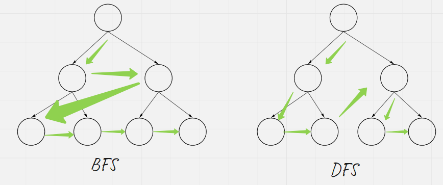

# Introduction

Search

* DFS
* BFS
* Prioritized search (Deep learning)

## Depth First Search

Depth-first search (DFS) is an algorithm for traversing or search tree or graph data structures. The algorithm starts at the root node ( selecting some arbitrary nodes as the root node in the case of a graph) and explores as far as possible along each branch before backtracking.

The time and space analysis of DFS differs according to its applications area. In theoretical computer science, DFS is typically used to traverse an entire graph, and takes time O(|V| + |E|)m where |V| is the number of vertices and |E| the number of edges. This is linear in the size of the graph.

For applications of DFS in relation to specific domains, such as searching for solutions in artificial intelligence or web-crawling, the graph to be traversed is often either too large to visit in its entirety or infinite (DFS may suffer from non-termination). In such cases, search is only performed to a limited depth.

Example of DFS

recursion

```java
public void dfs(Node node) {
    Set<Node> visited = new HashSet<>();
    dfs (node, visited);
}

private void dfs(Node node, Set<Node> visited) {
    //terminator
    if (node == null) {
        return;
    }
    //check if visited before
    if (visited.contains(node)) {
        return;
    }
    visited.add(node);
    //process current node
    process(node);
    
    //drill down
    if (node.children == null) {
        return;
    }
    
    for (Node child : node.children) {
        dfs(child, visited);
    } 
}
```

iteration

```java
public void dfs(Node node) {
    Set<Node> visited = new HashSet<>();
    if (node == null) {
        return;
    }
    
    Deque<Node> stack = new ArrayDeque<>();
    stack.push(node);
    
    while (!stack.isEmpty()) {
        Node cur = stack.pop();
        // In Java, Set#add would return false if element is already in the set
        if (!visited.add(cur)) {
            continue;
        }
        
        process(cur);
        if (cur.children == null) {
           continue;
        }
        for (Node child : node.children) {
            stack.push(child);
        }
    }
}
```


The above example is for graph. In a Direct Acyclic Graph such as tree, there is no need to check if a node has been visited because there is no cycle. 

```java
private void dfs(TreeNode root) {
    //terminator
    if (root == null) {
        return;
    }
    process(root);
    //drill down
    dfs(root.left);
    dfs(root.right);
}
```

Example: 

## Breadth First Search

Breadth-first search(BFS) is an algorithm for searching in a tree or graph data structure for a node that satisfies a given property. It starts at the root node (selecting some arbitrary nodes as the root node in the case of a graph) and explores all nodes at the present depth prior to moving on to the next nodes at the next depth level. Extra memory, usually a queue, is needed to keep track of the child nodes that were encountered but not yet explored.

If the cost of moving from one node to another are the same, BFS would find the shortest path from the root/source node because it visiting nodes layer by layer. The shortest path is found when the first time that destination node is visited. This would help to find minimum number of substitutions to make a word to transform to the target. 

Example

```java
public void bfs(Node source) {
    if (source == null) {
        return;
    }
    Set<Node> visited = new HashSet<>();
    Deque<Node> queue = new LinkedList<>();
    queue.offer(source);
    
    while (!queue.isEmpty()) {
        int size = queue.size();
        while (size-- > 0) {
            Node cur = queue.poll();
            if (!visited.add(cur)) {
                continue;
            }
            process(cur);
            if (cur.children == null) {
                continue;
            }
            for (Node child : cur.children) {
                queue.offer(child);
            }
        }
    }
} 
```

Similar to DFS, if the graph is a DAG such as a tree, checking if a node being visited is unnecessary.

```java
public void bfs(TreeNode root) {
    if (root == null) {
        return;
    }
    
    Deque<TreeNode> queue = new LinkedList<>();
    queue.offer(root);
    
    while (!queue.isEmpty()) {
        int size = queue.size();
        while (size-- > 0) {
           TreeNode cur = queue.poll();
            process(cur);
            if (cur.left != null) {
                queue.offer(cur.left);
            }
            if (cur.right != null) {
                queue.offer(cur.right);
            }
        }
    }
} 
```

The following graphs shows the difference between BFS and DFS during visiting a tree.



Note. the move from one branch to another branch in DFS is due to the parent stack invoking another branch. The leaf or sibling does not own a reference to the other branch. 

