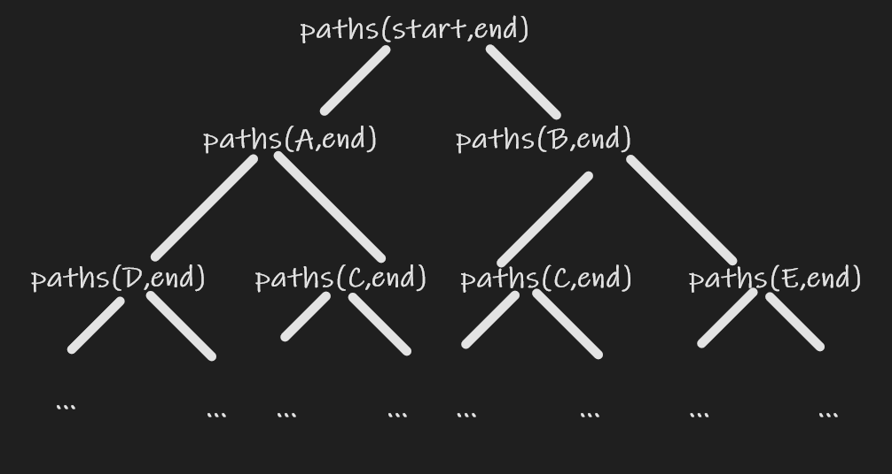

# Dynamic Programming

Dynamic Programming is both a mathematical optimization method and a computer programing method. It refers to simplifying a complicated problem by breaking it down into sub-problems in a recursive manner. While some decision  problems cannot be taken apart this way, decisions that span several points in time do often break apart recursively. Likewise, in computer science, if a problem can be solved optimally by breaking it into sub-problems and then recursively fining the optimal solutions to the sub-problems, then it is said to have optimal substructure.

Dynamic Programing is Divide and Conquer with optimal substructure

 ## Punchline 

1. Dynamic Programming is essentially an application of recursion or divide and conquer.
2. Commons  to other recursion and divide & conquer problem: solve the question by solving the sub-problems
3. Difference: If an optimal substructure exists for each sub-problem so that only the optimal solution of sub-problems are relevant to the final solution.

### DP solution

1. Optimal substructure 
2. Keep result of subproblems
3. Induction from subproblems

### Common Subproblems

|                                                              |        |                        |
| ------------------------------------------------------------ | ------ | ---------------------- |
| suffix (all the elements starting from the current)          | O(n)   | right to left          |
| prefix (all the elements ending by the current)              | O(n)   | left to right          |
| substrings (all consecutive elements starting from or ending by the current ) | O(n<sup>2</sup>) | increase the substring |


## Example

### Fibonacci sequence

[link](https://leetcode.com/problems/fibonacci-number/)

**Recursion by definition**

```java
public int fib(int n) {
    return n < 2 ? n : fib(n-1) + fib(n-2);
}
```

Time Complexity O(2<sup>n</sup>) . Space Complexity (log(n))

**Reduce Time Complexity with memorization**

```java
public int fib(int n) {
    int[] mem = new int[n + 1];
    return fib(n,mem);
}
private int fib(int n, int[] mem) {
    if (n < 2) { return n;}
    if (mem[n] < 1) {
        mem[n] = fib(n-1, mem) + fib(n-2, mem);
    }
    return mem[n];
}
```

Time Complexity O(n) . Space Complexity (n).

Time-Space Trade off

**Bottom up**

```java
public int fib(int n) {
    if (n < 2) { return n; }
    int[] dp = new int[n+1];
    dp[1] = 1;
    for (int i = 2; i < dp.length; ++i) {
        dp[i] = dp[i - 1] + dp[i - 2];
    }
    return dp[n];
}
```

Time Complexity O(n) . Space Complexity (n).

**constant space**

```java
public int fib(int n) {
    if (n < 2) { return n; }
    int first = 0;
    int second = 1;
    for (int i = 2; i <= n; i++) {
        second += first;
        first = second - first;
    }
    return second;
}
```

### Count the path

[link](https://leetcode.com/problems/unique-paths-ii)

Travel in a 2-D matrix from upper left corner to the lower right corner. There are some obstacles in the matrix which should be avoid. A travel can only travel right or travel down. Please find out how many ways a traveler can go.

| start | B     | E    |      |         |
| ----- | ----- | ---- | ---- | ------- |
| **A** | **C** |      |      |         |
| **D** |       |      |      |         |
|       |       |      |      | **end** |

  


As shown in above image, 

paths(start, end) = paths(A,end) + paths(B,end) = paths(D,end) + paths(C,end) + paths(C, end) + paths(E,end) = ...

It can be written in backtrack / recursion. As one can see, the paths(C, end) is called multiple times during the recursion. One way is memorization by adding a cache array in the recursion. Returns the result if the paths from that cell to the end is already computed.

Induction: 

compute all the entries in the last row (or the first row) would be only 1 direction to end if no block ahead. Similarly, it would be 1 way travel from last column if there is no block below. For other entry (i,j) 

opt(i,j) = isBlocked(a\[i][j]) ? 0 : opt(i+1,j) + opt(i,j+1);

```java
    public int uniquePathsWithObstacles(int[][] obstacleGrid) {
        final int RB = obstacleGrid.length;
        final int CB = obstacleGrid[0].length;
        // if start or end is blocked, no paths exist.
        if (obstacleGrid[RB-1][CB-1] > 0 || obstacleGrid[0][0] > 0) { return 0;}
        int[][] dp = new int[RB][CB];

        // populate last row
        for (int i = CB-1; i >=0; --i) {
            if (obstacleGrid[RB-1][i] > 0 ) { break; }
            dp[RB-1][i] = 1;
        }
        
        // populate last col
        for (int i = RB - 2; i >= 0; --i) {
            if (obstacleGrid[i][CB-1] > 0 ) { break; }
            dp[i][CB-1] = 1;
        }

        for (int i = RB - 2; i >= 0 ; --i) {
            for (int j = CB - 2; j >= 0; --j) {
                dp[i][j] = obstacleGrid[i][j] > 0 ? 0 : dp[i+1][j] + dp[i][j+1];
            }
        }
        return dp[0][0];
    }
```

Time Complexity: iterate over the matrix O(MN) where M is # of rows in obstacleGrid and N is # of cols in each row;

Space Complexity: extra space in dp matrix O (MN)

The induction function is rely on the below cell and the adjacent cell. Actually, one dimension array  is enough because we only depends on the last row and value computed right before the current cell.

```java
public int uniquePathsWithObstacles(int[][] obstacleGrid) {
        final int RB = obstacleGrid.length;
        final int CB = obstacleGrid[0].length;
        // if start or end is blocked, no paths exist.
        if (obstacleGrid[RB-1][CB-1] > 0 || obstacleGrid[0][0] > 0) { return 0;}
        int[] dp = new int[CB];

        // populate last row
        for (int i = CB-1; i >=0; --i) {
            if (obstacleGrid[RB-1][i] > 0 ) { break; }
            dp[i] = 1;
        }
       
        for (int i = RB - 2; i >= 0 ; --i) {
            if (obstacleGrid[i][CB-1] > 0) { 
                dp[CB-1] = 0; 
            } 
            for (int j = CB - 2; j >= 0; --j) {
                dp[j] = obstacleGrid[i][j] > 0 ? 0 : dp[j] + dp[j+1];
            }
        }
        return dp[0];
    }
```

Or populate from the first row

```java
public int uniquePathsWithObstacles(int[][] obstacleGrid) {
        final int R = obstacleGrid.length;
        final int C = obstacleGrid[0].length;
        if (obstacleGrid[0][0] == 1 || obstacleGrid[R-1][C-1] == 1) { return 0; }
        int[] dp = new int[C];
        dp[0] = 1;
        for (int i = 0; i < R; ++i) {
            if (obstacleGrid[i][0] == 1) {
                dp[0] = 0;
            } 
            for (int j = 1; j < C; ++j) {
                if (obstacleGrid[i][j] < 1) {
                    dp[j] += dp[j-1];
                } else {
                    dp[j] = 0;
                }
            }
        }
        return dp[C-1];
    }
```

Time complexity: the same as above O(MN);

space complexity: the dp array O(N)

### Longest Common Sequence

[link](https://leetcode.com/problems/longest-common-subsequence/)

Find the length longest common subsequence among two string text1 and text2.  A subsequence of a string is a new string generated from the original string with or without deleting some characters but no relative order is changed.

1. Brute Force
   enumerate every sequence in text1 and check if that is sequence in text2 as well. And keep the length of the longest. 

2. DP

   1. if either of text1 and text2 is empty, there is no common subsequence
   2. if text1 is a single character, the result depends on if text2 contains text1. If yes, 1. Otherwise, 0.
   3. If both string ends with the same character, the result is longest common sequence of two substring excluding last character + 1
   4. If two string ends different characters, the longest common sequence is the max of 
      1. LCS of  the second string and the substring of the first string exclude the last character
      2. LCS of first string and the substring of the second string exclude the last character

   1 and 2 would help initialization. 3 and 4 defines the subproblems

   Define DP matrix

   dp[i][j] is the longest common sequence between substring (0,i) of text1 and substring(0,j) of text2.

   ```java
       public int longestCommonSubsequence(String text1, String text2) {
           //extra row and col to initilize. As stated they are empty, there is no subsequence
           //the first row and the first colum are all 0's
           int[][] dp = new int[text1.length()+1][text2.length()+1];
           char[] tc1 = text1.toCharArray();
           char[] tc2 = text2.toCharArray();
           for (int i = 1; i < dp.length; ++i) {
               for (int j = 1; j < dp[i].length; ++j) {
                   dp[i][j] = tc1[i-1] == tc2[j-1] ? dp[i-1][j-1] + 1: Math.max(dp[i][j-1],dp[i-1][j]);
               }
           }
           return dp[tc1.length][tc2.length];
       }
   ```

   Time complexity: compare every character in text1 with every character in text2 O(MN) where M is the length of text1 and N is that of text2

   Space complexity: dp matrix O(MN);
   
   If initialize with 2 (single character) instead of 1(both empty).
   
   ```java
       public int longestCommonSubsequence(String text1, String text2) {
           if (text1 == null || text2 == null || text1.length() == 0 || text2.length() == 0) { return 0; }
           int[][] dp = new int[text1.length()][text2.length()];
           char[] tc1 = text1.toCharArray();
           char[] tc2 = text2.toCharArray();
           if (tc1[0] == tc2[0]) {
               dp[0][0] = 1;
           }
           for (int i = 1; i < tc2.length; ++i) {
               dp[0][i] = tc1[0] == tc2[i] ? 1 : dp[0][i-1];
           }
   
           for (int i = 1; i < tc1.length; ++i) {
               dp[i][0] = tc1[i] == tc2[0] ? 1 : dp[i-1][0];
           }
   
           for (int i = 1; i < tc1.length; ++i) {
               for (int j = 1; j < tc2.length; ++j) {
                   dp[i][j] = tc1[i] == tc2[j ? dp[i-1][j-1] + 1: Math.max(dp[i][j-1],dp[i-1][j]);
               }
           }
           return dp[tc1.length-1][tc2.length-1];
       }
   ```
   
   Time complexity and Space complexity does not change.
   
   Reduce space complexity because the iteration is only depends on dp[i-1][j-1], dp[i][j-1] and dp[i-1][j]. dp[i-1][j-1] can be stored in a dedicated variable to avoid to be overwritten.
   
   ```java
       public int longestCommonSubsequence(String text1, String text2) {
           char[] chars1 = text1.toCharArray();
           char[] chars2 = text2.toCharArray();
           int[] dp = new int[chars2.length+1];
           for (int i = 1; i <= chars1.length; ++i) {
               char ch = chars1[i-1];
               int prev = 0;
               for (int j = 1; j <= chars2.length; ++j) {
                   int temp = dp[j];//next prev aka dp[i-1][j-1]
                   dp[j] = ch == chars2[j-1] ? prev + 1 : Math.max(dp[j-1],dp[j]);
                   prev = temp;
               }
           }
           return dp[chars2.length];
       }
   ```
   
   Time complexity: O(MN)
   
   Space complexity: O(n)
   
   #### Related question
   
   [delete operation for two strings](https://leetcode.com/problems/delete-operation-for-two-strings/)
   
   find the minimum number of deletions to make two string text1 and text2 the same string.
   
   hint: the sum of ( the length of text1 - the length of the longest common sequence) and  (the length of text2 - length of the longest common sequence)
   
   ### 0-1Knapsack Problem
   
   Give a list of items. Their sizes and values are given in array s and array v. A knapsack can fill at most size S. Find the max values that can be filled in the knapsack.
   
   1.  BF
      Try all possible combinations O(2<sup>n</sup>)
   
   2. DP
   
      Guessing: is item i in the knapsack or not? -> 2 choices
   
      subproblems: suffix i: of items and remaining capacity x <=S if only i: of items are considered. The following is not correct.
   
      ```bash
      dp[i] = f(dp[i+1],dp[i+1] + vi); 
      ```
   
      there is no way to tell if i can be put or not. so this is an incorrect algorithm
   
      Since we need to know if x<=S, one additional dimension can help.
   
      ```bash
      dp[i][x] = max(dp[i+1][x],dp[i+1][x-si] + vi);
      ```
   
      topological order:
   
      ```bash
      for (int i = 0 ; i <= s.length;++i) {
         for (int j = 0; j <= S; ++j) {
             ....
         }
      }
      ```
   
      original problem: dp[s.length][S]
   
      ```java
         public int knapsack(int[] size, int[] value, final int S) {
             int[][] dp = new int[size.length + 1][S + 1];
             for (int i = 1; i < dp.length; ++i) {
                 for (int j = 1; j <= S; ++j) {
                     if (j < size[i-1]) {
                         dp[i][j] = dp[i-1][j];
                     } else {
                         dp[i][j] = Math.max(dp[i-1][j],dp[i-1][j-size[i-1]] + value[i-1]);
                     }
                     
                 }
             }
             return dp[size.length][S];
         }
      ```
   
      Time complexity: nest loop: O(nS);
   
      Space complexity: dp array: O(nS);
   
      Note this only depends on dp[i-1][j] and dp[i-1][j-size[i-1]]. The space can reduced.
   
      ```java
         public int knapsack(int[] size, int[] value, final int S) {
             int[] dp = new int[S + 1];
             for (int i = 1; i <= size.length; ++i) {
                 for (int j = S; j > 0; --j) {
                     if (j >= size[i-1]) {
                         dp[j] = Math.max(dp[j],dp[j-size[i-1]] + value[i-1]);
                     }
                 }
             }
             return dp[S];
         }
      ```
   
      Time complexity: nest loop: O(nS);
   
      Space complexity: dp array: O(S);
   
   #### Note
   
   O(nS) is polynomial of n and S. But for this question, we would focus the length of array. O(nS) is not polynomial in terms of n. O(nlog(S)) is polynomial. O(nS) is exponential (S is exponential of log(S)). This is also called pseudo polynomial of n.
   
   * polynomial -> good
   * non-polynomial -> bad
   * pseudo-polynomial -> so so
   
   #### similar questions but a better method is available.
   
   [1833](https://leetcode.com/problems/maximum-ice-cream-bars)
   
   A boy wants to buy some ice cream bars. There are n ice cream bars. You are given an array costs of length n, where costs[i] is the price of the ith ice cream bar in coins. The boy initially has coins coins to spend, and he wants to buy as many ice cream bars as possible. Find out the maximum number of ice cream bars the boy can buy with coins coins.
   
   
   
   The above question can be resolved as 0-1 knapsack problem. But the most efficient way to apply sort + greedy algorithm. This is because all the ice cream bar has the same value. We just need to fill the knapsack with small weights (in this case the cost) as many as possible. Replacing any weight with a higher weight would not increase the value but would reduce the chance of adding another item. This is no need to loop over S or n in this case.
   
   variant:
   
   Given a set of items, each with an **arbitrary positive weight** and a **value = 1 or 2** , determine which items to include in a collection so that the total weight is less than or equal to a given limit and the total value is as large as possible. Solve in polynomial time.
   
   As discussed, knapsack is pseudo-polynomial algorithm. This one is asking for polynomial solution. This is a variant of the ice cream bar question. 
   
   Divide the array into to parts one with value=1 only and the other is value = 2 only. Each of them can be resolved in sort (by weight)  + greedy.
   
   iterate all cases that weights from first part + weights from second parts <= W, either of the two weights can be 0. And actually for a fixed weight from first part, we can use greedy algorithm to find the max values under W - w1 in the second part. i.e. two sum prefix array for value = 1 and value =2. Get their combinations in O(nlog(n)) time (binary search to find the max w2 <= W-w1).
   
   ## Summary
   
   1. Looking for repeatable subproblems because a computer only can instruct if-else, recursion and loop.
   2. Understand the key point -> how to divide and conquer
   3. Manually simulation of a DP process might be hard.
   
   ## five steps to DP
   
   1. define subproblems
   2. guess (part of solutions)
   3. solve subproblems
   4. recurs and memorize or build DP lookup table (bottom up)
   5. solve the original problem
