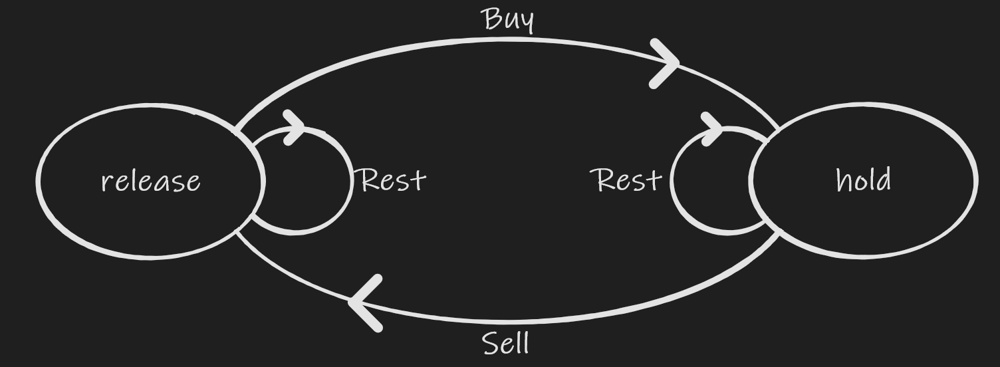

## Best Time to Buy and Sell Stock

Best Time to Buy and Sell Stock are a serial problems can be solved by dynamic programming. Although some problems can be solved by other algorithm, one solution cannot be applied to another. dynamic programming technical can be used to solve all of them.  The following relations are in all of those stock problems.



A release status means possession of no stocks and the hold status means possession of one stock. Release status would be transferred from by selling holding stock or keep current status. Similarly, hold status would be transferred from by buying if no stock hold or keep current status. In this serial of problems, one can only hold at most one stock. If a customer can buy more stocks, This is similar, E.g. status of holding 2 stocks and status of holding 3 stocks are similar to release and hold as stated above. 

### Best Time to Buy and Sell Stock

[link](https://leetcode.com/problems/best-time-to-buy-and-sell-stock/)

Stock prices are given as an array. the prices at the ith day is given by prices[i], i starts from 0. Please max the profit by choosing one day to buy a stock and choose a later day to sell the prices. The difference between their prices is the profit.

At each step, there are two status : release and hold.  To buy a stock, a prices should be paid. Because, only one purchase is allowed. there is no need to consider buying a second stock after sold.

```java
// 0 means 0 stock and 1 means 1 stock
dp[i][0] = Math.max(dp[i-1][0], dp[i-1][1] + prices[i]);
dp[i][1] = Math.max(dp[i-1][1], -prices[i]); // 0 - prices[i]
```

```java
    public int maxProfit(int[] prices) {
        int[][] dp = new int[prices.length][2];
        dp[0][1] = -prices[0];
        for (int i = 1; i < dp.length; ++i) {
            dp[i][0] = Math.max(dp[i-1][0], dp[i-1][1] + prices[i]);
            dp[i][1] = Math.max(dp[i-1][1], -prices[i]);
        }
        return dp[prices.length-1][0];
    }
```

Time complexity:  iterate over all days. O(N)

Space complexity: O(N);

Notice that dp[i] is only depends on dp[i-1], prices[i]. The space complexity can be reduced to constant.

```java
    public int maxProfit(int[] prices) {
        int release = 0;
        int hold = -prices[0];
        for (int i = 1; i < prices.length; ++i) {
            release = Math.max(release, hold + prices[i]);
            hold = Math.max(hold, -prices[i]);
        }
        return release;
    }
```

Of course, the constant solution can also be explained by greedy. To buy from the least prices seeing so far and check if sold at current prices to generate more profit. the smaller prices[i] the larger -prices[i]. An more easy to understand greedy is the following

```java
    public int maxProfit(int[] prices) {
        int profit = 0;
        int min = prices[0];
        for (int i = 1; i < prices.length; ++i) {
            profit = Math.max(profit, prices[i] - min);
            min = Math.min(min, prices[i]);
        }
        return profit;
    }
```

### Best Time to Buy and Sell Stock II

[Link](https://leetcode.com/problems/best-time-to-buy-and-sell-stock-ii/)

The same as previous questions except that one can buy as many times as s/he wants as long as s/he only holds at most one stock.

Because one can buy multiple times as long as at most one stock is hold. The maximal profit if buying a stock at ith day should take account of profits gained in previous transactions. dp[i][1] = Math.max(dp[i-1][1], -prices[i]); in previous problem should be modified to dp[i][1] = Math.max(dp[i-1][1], dp[i-1][0] - prices[i]);

```java
    public int maxProfit(int[] prices) {
        int[][] dp = new int[prices.length][2];
        dp[0][1] = -prices[0];
        for (int i = 1; i < dp.length; ++i) {
            dp[i][0] = Math.max(dp[i-1][0], dp[i-1][1] + prices[i]);
            dp[i][1] = Math.max(dp[i-1][1],  dp[i-1][0] - prices[i]);
        }
        return dp[prices.length-1][0];
    }
```

Time complexity and Space complexity are the same as previous one.

Similar to previous problem, the space complexity can be reduced to constant.

```java
    public int maxProfit(int[] prices) {
        int release = 0;
        int hold = -prices[0];
        for (int i = 1; i < prices.length; ++i) {
            int temp = release;
            release = Math.max(release, hold + prices[i]);
            hold = Math.max(hold, temp - prices[i]);
        }
        return release;
    }
```

There is also a greedy solution to this problem that is buying and selling the stock as long as prices[i-1] < prices[i] because one can purchase as many times as s/he wants. 

### Best Time to Buy and Sell Stock III

[Link](https://leetcode.com/problems/best-time-to-buy-and-sell-stock-iii/)

The same as previous problem except at most two transactions are allowed. One transaction meaning purchase and selling a stock.

Apparently, we need a way to represent transferring from zero transaction to one transaction and from one transaction to two transactions. So, an additional dimension is required.

```java
// dp[i][j][0] ith day at j's transaction without any stock 
dp[i][0][0] = dp[i-1][0][0];
dp[i][0][1] = Math.max(dp[i-1][1], dp[i-1][0][0] - prices[i]);

dp[i][1][0] = Math.max(dp[i-1][1][0], dp[i-1][0][1] + prices[i]);
dp[i][1][1] = Math.max(dp[i-1][1][1], dp[i-1][1][0] - prices[i]);

dp[i][2][0] = Math.max(dp[i-1][2][0], dp[i-1][1][1] + prices[i]);
dp[i][2][1] = Math.max(dp[i-1][2][1], dp[i-1][2][0] - prices[i]);
```

The state transformation is similar to previous image. The transaction is defined at selling a holding stock. So, the dp[i][j][0] is transfer from rest or from selling stock from previous purchase with j -1 transactions. The holding is from purchase stock from the release status with j transaction because the transaction is completed only after selling the stock. 

We actually do not need dp[i][2][1] because it cannot be sold and there is a penalty of - prices[i] and dp[i][0][0] is always 0.dp[0][1] and dp[0][2] are impossible. they should be initialized with a very small value.

```java
    public int maxProfit(int[] prices) { 
        int[][][] dp = new int[prices.length][3][2];
        for (int i = 0; i < 3; ++i) {
            // the problems list the max prices is 100000. Use Integer.MIN_VALUE may lead to overflow
            Arrays.fill(dp[0][i],-100000);
        }
        dp[0][0][0] = 0;
        dp[0][0][1] = -prices[0];
        for (int i = 1; i < prices.length; ++i) {
            dp[i][0][1] = Math.max(dp[i-1][0][1], -prices[i]);
            
            dp[i][1][0] = Math.max(dp[i-1][1][0], dp[i-1][0][1] + prices[i]);
            dp[i][1][1] = Math.max(dp[i-1][1][1], dp[i-1][1][0] - prices[i]);
            
            dp[i][2][0] = Math.max(dp[i-1][2][0], dp[i-1][1][1] + prices[i]);
        }
        // the result is from dp[prices.length-1][0][0] (always 0), dp[prices.length-1][1][0] and dp[prices.length-1][2][0]
        return Math.max(0,Math.max(dp[prices.length-1][1][0],dp[prices.length-1][2][0]));
    }
```

Time complexity:  iterate over prices array O(N);

Space complexity: the size of the addy 2x3xN => O(N).

Simliar to previous problems, because dp[i] only depends on dp[i-1] and  other conditions are fixed. This can be solved with constant space.

```java
    public int maxProfit(int[] prices) { 
        int firstPurchase = -prices[0];
        int firstSold = -100000;
        int secondPurcahse = -100000;
        int secondSold = -100000;
        for (int i = 1; i < prices.length; ++i) {
            secondSold = Math.max(secondSold, secondPurcahse + prices[i]);
            secondPurcahse = Math.max(secondPurcahse, firstSold  - prices[i]);
            
            firstSold  = Math.max(firstSold, firstPurchase + prices[i]);
            firstPurchase = Math.max(firstPurchase, -prices[i]);
            
        }
        return Math.max(0,Math.max(firstSold,secondSold));
    }
```

Note in the loop, the order is rearranged because when calculate a new value it should be based on values in previous iteration instead of the current one.

```java
dp[i][2][0] = Math.max(dp[i-1][2][0], dp[i-1][1][1] + prices[i]);
dp[i][1][1] = Math.max(dp[i-1][1][1], dp[i-1][1][0] - prices[i]);
dp[i][1][0] = Math.max(dp[i-1][1][0], dp[i-1][0][1] + prices[i]);
dp[i][0][1] = Math.max(dp[i-1][0][1], -prices[i]);
```

### Best Time to Buy and Sell Stock IV

[Link](https://leetcode.com/problems/best-time-to-buy-and-sell-stock-iv/)

This is A generalization of III. Instead of allow max of 2 transaction. it allows at most k transactions now. 

It is trival to modify the solution of III to adopt the change.

```java
    public int maxProfit(int k, int[] prices) {
        if (prices.length == 0 || k == 0) { return 0; }
        int[][][] dp = new int[prices.length][k+1][2];
        for (int i = 0; i <= k ; ++i) {
            Arrays.fill(dp[0][i],-1000);
        }
        dp[0][0][0] = 0;
        dp[0][0][1] = -prices[0];
        int res = 0;
        for (int i = 1; i < prices.length; ++i) {
            dp[i][0][1] = Math.max(dp[i-1][0][1], -prices[i]);
            for (int j = 1; j < k; ++j) {
                dp[i][j][0] = Math.max(dp[i-1][j][0], dp[i-1][j-1][1] + prices[i]);
                dp[i][j][1] = Math.max(dp[i-1][j][1], dp[i-1][j][0] - prices[i]);
                if (i == prices.length - 1) {
                    res = Math.max(res,dp[i][j][0]);
                }
            }
            dp[i][k][0] = Math.max(dp[i-1][k][0], dp[i-1][k-1][1] + prices[i]);
            if (i == prices.length - 1) {
                res = Math.max(res,dp[i][k][0]);
            }
        }
        return res;
    }
```

Time complexity: the nested loop O(kn) where n is the length prices

Space complexity: is also O(kn) as 2 is constant.

Solve with 2-D array

```java
    public int maxProfit(int k, int[] prices) {
        if (prices.length == 0 || k == 0) { return 0; }
        int[][] dp = new int[k+1][2];
        for (int i = 0; i <= k ; ++i) {
            Arrays.fill(dp[i],-1000);
        }
        dp[0][0] = 0;
        dp[0][1] = -prices[0];
        int res = 0;
        for (int i = 1; i < prices.length; ++i) {
            int[][] temp = new int[k+1][2];
            temp[0][1] = Math.max(dp[0][1], -prices[i]);
            for (int j = 1; j < k; ++j) {
                temp[j][0] = Math.max(dp[j][0], dp[j-1][1] + prices[i]);
                temp[j][1] = Math.max(dp[j][1], dp[j][0] - prices[i]);
                if (i == prices.length - 1) {
                    res = Math.max(res,temp[j][0]);
                }
            }
            temp[k][0] = Math.max(dp[k][0], dp[k-1][1] + prices[i]);
            if (i == prices.length - 1) {
                res = Math.max(res,temp[k][0]);
            }
            dp = temp;
        }
        return res;
    }
```

As observed in constant space solution in III. There is no need to create a new array each time.  We can simliarly reuse the dp array but to prevent effecting by current day, it requires iterating j in reverse order. and caculate dp\[j]\[1] before dp\[j]\[0].

```java
    public int maxProfit(int k, int[] prices) {
        if (prices.length == 0 || k == 0) { return 0; }
        int[][] dp = new int[k+1][2];
        for (int i = 0; i <= k ; ++i) {
            Arrays.fill(dp[i],-1000);
        }
        dp[0][0] = 0;
        dp[0][1] = -prices[0];
        int res = 0;
        for (int i = 1; i < prices.length; ++i) {
            dp[k][0] = Math.max(dp[k][0], dp[k-1][1] + prices[i]);
            if (i == prices.length - 1) {
                res = Math.max(res,dp[k][0]);
            }
            
            for (int j = k - 1; j > 0; --j) {
                dp[j][1] = Math.max(dp[j][1], dp[j][0] - prices[i]);
                dp[j][0] = Math.max(dp[j][0], dp[j-1][1] + prices[i]);
                if (i == prices.length - 1) {
                    res = Math.max(res,dp[j][0]);
                }
            }
            
            dp[0][1] = Math.max(dp[0][1], -prices[i]);
        }
        return res;
    }
```

### Best Time to Buy and Sell Stock with cooldown 

[Link]([https://leetcode.com/problems/best-time-to-buy-and-sell-stock-with-cooldown/)

This is a variation of problem II. There is no limit on how many transaction one can perform but no purchase on the day and the next day after selling the stock.

Apparently, we still need a third dimension. It is different from III and IV presenting the transaction. In this case, that dimension is to tell if a stock was told on that day.

 ```java
 //dp[i][0][1] on ith day, no stock was sold and hold one stock
 dp[i][0][0] = Math.max(dp[i-1][0][0], dp[i-1][1][0]); //keep empty account or after cooldown
 dp[i][0][1] = Math.max(dp[i-1][0][1], dp[i-1][0][0] - prices[i]);// stock can be pnly purchase if no selling on previous day
 dp[i][1][0] = dp[i-1][0][1] + prices[i];
 ```

```java
    public int maxProfit(int[] prices) {
        int[][][] dp = new int[prices.length][2][2];
        Arrays.fill(dp[0][1],-1000);
        dp[0][0][1] = -prices[0];
        for (int i = 1; i < prices.length; ++i) {
            dp[i][0][0] = Math.max(dp[i-1][0][0], dp[i-1][1][0]);
            dp[i][0][1] = Math.max(dp[i-1][0][1], dp[i-1][0][0] - prices[i]);
            dp[i][1][0] = dp[i-1][0][1] + prices[i];            
        }
        return Math.max(dp[prices.length-1][0][0],dp[prices.length-1][1][0]);
    }
```

Time complexity: O(n)

Space Complexity: O(n);

To solve with constant space

```java
    public int maxProfit(int[] prices) {
        int empty = 0;
        int hold = -prices[0];
        int sell = -1000;
        for (int i = 1; i < prices.length; ++i) {        
            int temp = empty;
            empty = Math.max(empty,sell);
            sell = hold + prices[i];
            hold = Math.max(hold,temp - prices[i]);          
        }
        return Math.max(empty,sell);
    }
```

Again the order is changed to make sure there is no side effect.

```java
int temp = dp[i-1][0][0];
dp[i][0][0] = Math.max(temp, dp[i-1][1][0]);
dp[i][1][0] = dp[i-1][0][1] + prices[i]; 
dp[i][0][1] = Math.max(dp[i-1][0][1], temp - prices[i]);            
```

### Best Time to Buy and Sell Stock with Transaction Fee 

This is A variant of II. One can buy and sell the stock as many times as s/he wants but there is a transaction fee at the time of selling the stock. The optimal substructure is the same as the II except there is a fee added when dp[i-1][1] is transferred to dp[i][0].

```java
    public int maxProfit(int[] prices, int fee) {
        int[][] dp = new int[prices.length][2];
        dp[0][1] = - prices[0];
        for (int i = 1; i < prices.length; ++i) {
            dp[i][0] = Math.max(dp[i-1][0],dp[i-1][1] + prices[i] - fee);
            dp[i][1] = Math.max(dp[i-1][1],dp[i-1][0] - prices[i]);
        }
        return dp[prices.length - 1][0];
    }
```

Time complexity: O(n)

Space complexity: O(n);

Solve with constant space

```java
    public int maxProfit(int[] prices, int fee) {
        int release = 0;
        int hold = -prices[0];
        for (int i = 1; i < prices.length; ++i) {
            int temp = release;
            release = Math.max(release,hold + prices[i] - fee);
            hold = Math.max(hold,temp - prices[i]);
        }
        return release;
    }
```

