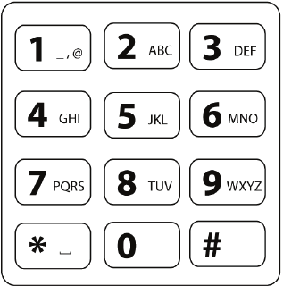

## Letter Combinations of a Phone Number

[Link](https://leetcode.com/problems/letter-combinations-of-a-phone-number/)

Given a string containing digits from 2-9 inclusive, return all possible letter combinations that the number could represent.



### Solution

It asks for all possible combinations without duplicates. We can apply backtrack to search all the possible solutions. First we need a mapping of digits to characters. This can be a Map or a 2-d char array (the digits from 2 - 9 is limited and consecutive).During the search, we need something to save current choice. Because it is character, one can use StringBuilder. However, each action with StringBuilder would check if the index out of boundary. And we know all the combinations have the same length as the input digit string. We can use char array instead. Another benefit of char array is that we do not need deliberately restore the state each time since we can use the the index every time. For empty string, there is no need to check we can return the empty list directly. Otherwise, we would have a special case in termination part in recursion function.

```java
    private final static char[][] chars = {
        {'a','b','c'},
        {'d','e','f'},
        {'g','h','i'},
        {'j','k','l'},
        {'m','n','o'},
        {'p','q','r','s'},
        {'t','u','v'},
        {'w','x','y','z'}
    };
    public List<String> letterCombinations(String digits) {
        List<String> res = new LinkedList<>();
        //check if it is an empty string
        if (digits.length() == 0) {
            return res;
        }
        
        backtrack(digits.toCharArray(),0, new char[digits.length()], res);
        return res;
    }
    
    private void backtrack(char[] digits, int idx, char[] cand, List<String> res) {
        //terminatio: processed all the characters in digits. Adding to the list
        if (idx == digits.length) {
            res.add(String.valueOf(cand));
            return;
        }
        // match the index of chars
        int cur = digits[idx] - '2';
        for (char ch : chars[cur]) {
            //process
            cand[idx] = ch;
            //drill down
            backtrack(digits, idx+1, cand, res);
        }
//        If StirngBuilder is used instead of char array (sb is the string builder)
//        for (char ch : chars[cur]) {
//            //process
//            sb.append(ch);
//            //drill down
//            backtrack(digits, idx+1, sb, res);
//            //restore state
//            sb.remove(sb.length() - 1);
//        }
    }
```

Time complexity: All the digits maps to 3 characters would be 3 choice and maps to 4 characters would be 4 choice O(3^n^4^m^) where n is number of digits mapping to 3 characters and m is that mapping to 4 character.

Space complexity: The depth of recursion is number of character in the digits O(n+m)

