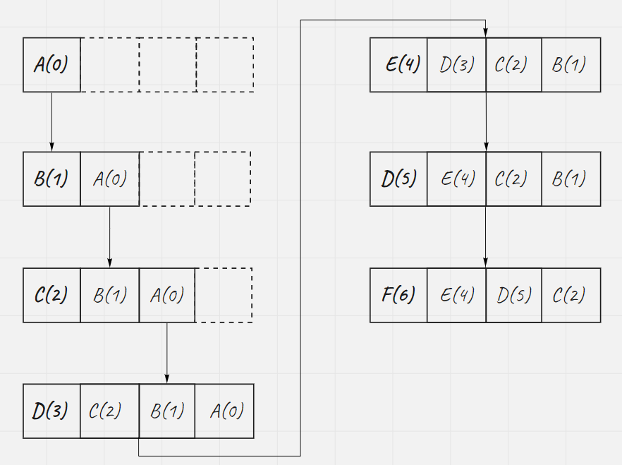

# Introduction

## Cache Replacement policies

In computingg, cache algorithms (also frequently called cache replacement algorithms or cache replacement policies) are optimizing instructions, or alogirthms, that a computer program or a hardware-maintained structure can utilize in order to manage a cache of information stored on the computer. Caching improves performance by keep recent or often-used data items in memory locations that are faster or computationally cheaper to access than normal memory stores. When the cache is full, the algorithm must choose which items to discard to make room for the new ones.

For full list of cache replacement policies, please check [Cache Replacement policies](https://en.wikipedia.org/wiki/Cache_replacement_policies)

### Least Recently Used(LRU)

Discards the least recently used items first. This algorithm requires keeping track of what was used when, which is expensive if one wants to make sure the algorithm always discards the least recently used them. General implementations of this technique required keeping "age bits" for cache-lines and track the "Least Recently Used" cache-line based on age-bits. In such an implementation, every time a cache-line is used, the age of all other cache-line changes. LRU is actually a family of cache algortihms with members.

The above image shows the age-bits implementation. Every time a cache is used. The age bits updated and the element with oldest age-bits would be evicted when there is no enough space.

This is a LinkedList implementation. To compare the methods. we keep the age-bits. But it is not necessary. The order appeared in the list tells which one is older. Every time a element is used, it would be put in the front of the Linked list. When there is no enough space, the last element of the list is evicted. Of course, we should provide high performant lookup for cahces. O(n) lookup is not acceptable. So we need a map for lookup in O(1).

### Least Frequently Used (LFU)

Counts how often an item is needed. Those that are used least often are discarded first. This works very similar to LRU except that instead of storing the value of how recently a block was accessed, we store the value of how many times it was accessed. So of course while running an access sequence we will replace a block which was used the fewest times from our cache. E.g If A was used (accessed) 5 times and B was used 3 times and others C and d were used 10 times each, we will replace B.

#### Implementation

The simplest method to employ an LFU algorithm is to assign a counter to every block that is loaded into the cache. Each time a reference is made to that block the counter is increased by one. When the cache reaches capacity and has a new block waiting to be inserted the system will search for the block with the lowest counter and remove it from the cache.

#### Problems

While the LFU method may seems like an intuitive approach to memory management it is not without faluts. Consider an item in memory which is referenced repeatedly for a short period of time and it not accessed again for an extended period of time. Due to how rapidly it was just accessed its counter has increased drastically even though it will not be used again for a decent amount of time. This leaves other blocks which may actually be used more frequently susceptible to purging simply because they were accessed through a different method.

Moreover, new items that just entered the cache are subject to being removed very soon again, because they start with a low counter, even though they might be used very frequently after that. 