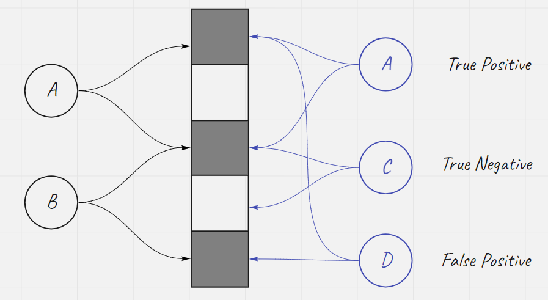
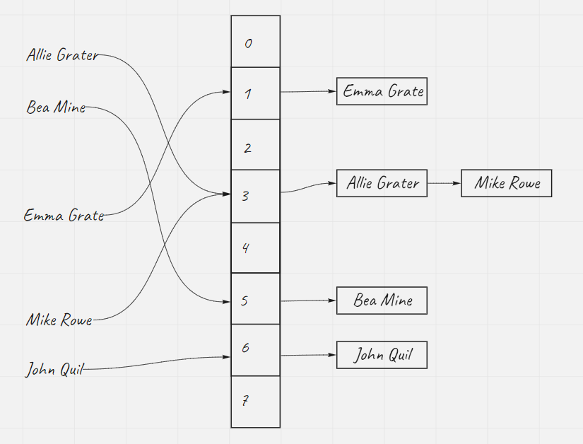

# Introduction

A Bloom Filter is a space-efficient probabilistic data structure, that is used to test whether an element is a member of a set. **False positive matches are possible but false negatives are not.**

An empty Bloom Filter is a bit array of m bits all set to 0. There must also be k different hash functions defined. each of which maps or hashes some set element to one of the many positions, generating a uniform random distribution.

To add an element, feed it to each k hash functions to get k array positions. Set the bits at all these positions to 1.

Pro

* efficiency in time and space (way better than others)

Con

* False positive are possible. 
* Remove an elements affects matches of other element

In contrast, The hash Map would store all the value. Here is an example with HashTable + Chaining

