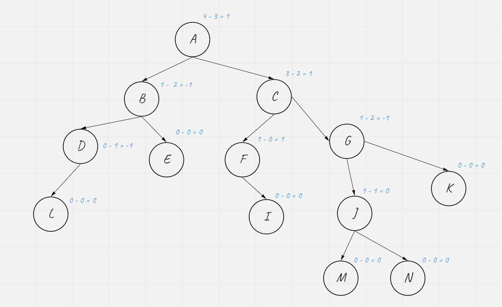
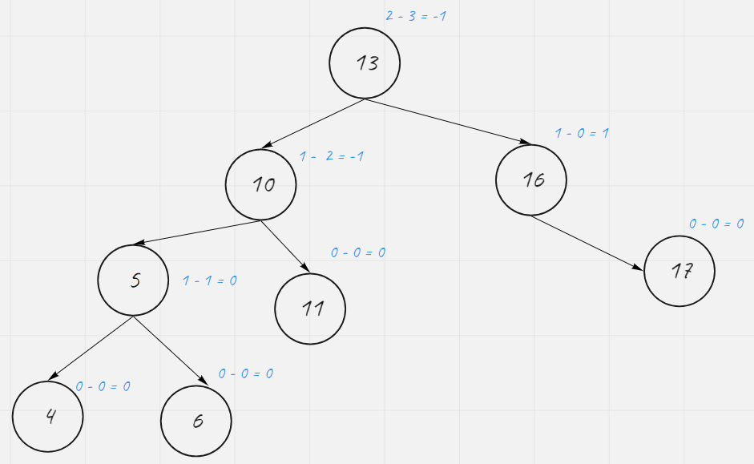
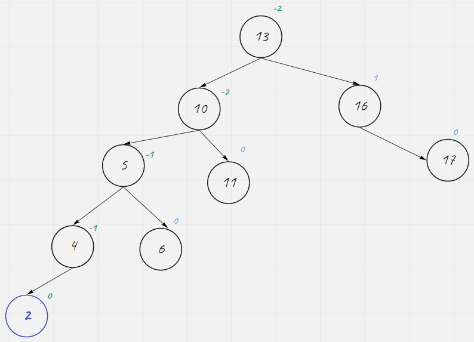
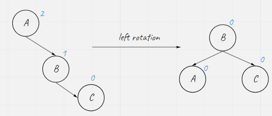
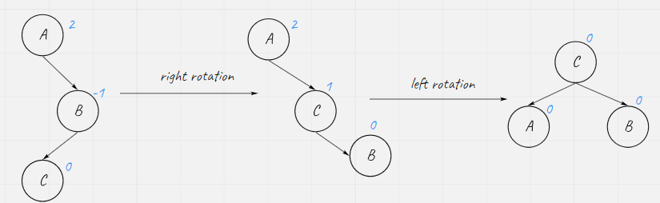
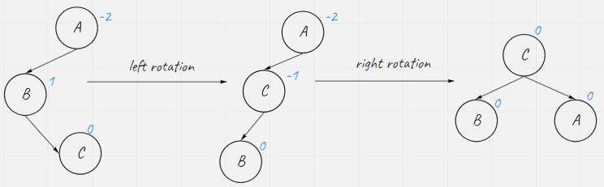
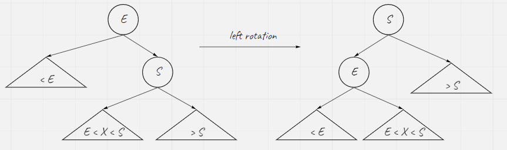
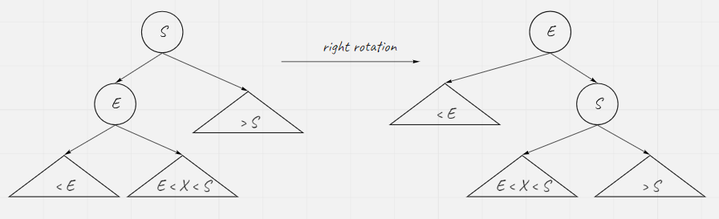
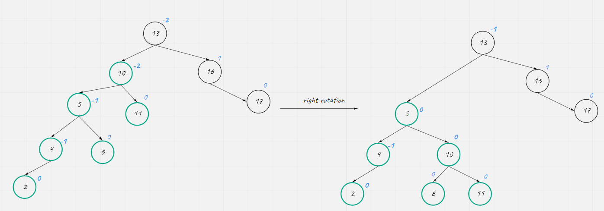
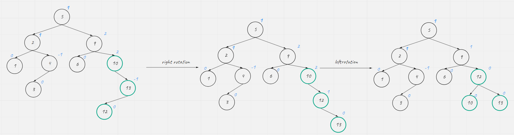

# Introduction

## Self-balancing binary search Tree

In computer science, a self-balancing (or height-balanced) binary search tree is any node-based binary tree that automatically keeps its height (maximal number of levels below the root) small in the face of arbitrary item insertions and deletions.

* 2-3 tree
* AVL tree
* Red-Black tree
* B-tree
* Splay tree
* Treap
* ...

### AVL Tree

In computer science, an AVL tree (named after inventors Adelson-Velsky and Landis) is a self-balancing binary search tree. It was the first such data structure to be invented. In an AVL tree, the heights of the two child subtrees of any node differ by at most one; if at any time they differ by more than one, rebalancing is done to restore this property. Lookup, insertion and deletion all takes O(logn) time in both the average and worst cases, where n is the number of nodes in the tree prior to the operation. Insertions and deletions may require the tree to be rebalanced by one or more tree rotations.

AVL trees are often compared with red-black trees because both support the same set of opertions and take O(logn) time for basic operations. For lookup-intensive applications, AVL trees are faster than red-black trees because they are more strictly balanced. Similar to red-black trees, AVL trees are height-balanced. Both are, in general, neither weight-balanced nor μ-balanced for any μ <= 1/2; that is, sibling nodes can have hugely differing numbers of descendants. 

#### Balance factor

In a binary tree, the balance factor of a node X is defined to be the height difference

BF(X) = Height(RightSubtree(X)) - Height(LeftSubtree(X)) 

of its two child sub-trees. A binary tree is defined to be an AVL tree if the invariant

BF(X) ∈ {-1, 0, 1}

Example of balance factor

#### Rebalancing

##### Insertion

1. Insert a node without making Balance Factor out of range. -> Do Nothing (e.g Insert 12 in the above tree. It would be the right child node of 11. The balance factor of 11 become 1 and 10 would be 0. Nothing else changed.)
2. cause the a balance factor out of range. E.g. Insert 2.

As you can see. The Balance Factor of node 10 and node 13 become -2. We need to adjust them

#### Operations

AVL rotate the nodes to rebalance

* Simple rotation
  * right
    
  * left
    
* double rotation
  * right-left
    
  * left-right
    

Rotate Subtrees

* left rotation
  
* right rotation
   

After inert 2, we can right rotate to rebalance

An example of double rotation

Pros:  AVL tree strictly maintains the difference between any subtrees. That means the performance is alwasy O(logn)

Cons: Every node should keep additional information. Rotation is quite often -> The insertion/deletion cost is high.

### Red-Black Tree

To reduce insertion cost, we can loosen the balance factor restriction.

In computer science, a red-black tree is a kind of self-balancing binary search tree. Each node stores an extra bit representing "color" ("red" or "black"), used to ensure that the tree remains balanced during insertions and deletions.

When the tree is modified, the new tree is rearranged and "repainted" to store the coloring properties that constrain how unbalanced the tree can become in the worst case. The properties are designed such that this rearrange and recoloring can be performed efficiently.

The rebalancing is not perfact, but guarantees searching in O(logn) time, where n is the number of nodes of the tree.The insertion and deletion  operations, along with the tree rearrangement and recoloring, are also performed in O(logn) time.

In addition to the requirement imposed on a binary search tree, the following must be satisfied by a red-black tree

1. Each node is either red or black
2. ALL NULL/NIL Leaves are consider black (NULL Leaves are NULL children of a leaf)
3. If a node is red, then both its children are black
4. Every path from a given node to any of its descendant NULL Leaves go through the same number of black nodes

With above conditions, we can also conclude the following.

For any node, Max(subtree height) <= 2 * Min(subtree height)

### Comparison of the two

* AVL trees provide faster lookups than Red-Black Trees because the are more strictly balanced
* Red-Black Trees provide faster insertion and deletion operations than the AVL trees as fewer rotations are done due to relatively relaxed balancing
* AVL trees store balanced factor or heights with each node, thus requires storage for an integer per node whereas Red-Black Tree requires only 1 bit of information per node.
* Red-Black Trees are used in most of the language libraries like map, multimap, multiset in C++ and TreeMap in Java whereas AVL tree  are more likely to be used in databases where faster retrievals are required. It is not necessary to use AVL tree in the database. In MySQL, B+ tree is backing for the index. 

