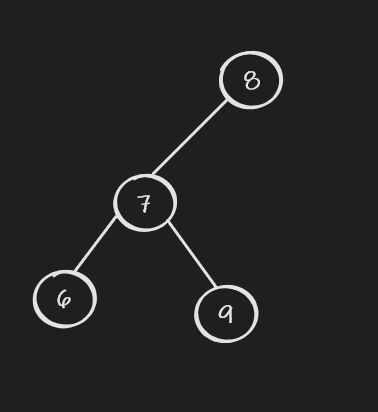

## Tree Related Recursion

### Invert Binary Tree

[Link](https://leetcode.com/problems/invert-binary-tree/)

Given the root of a tree, invert the tree. That is swapping the left child with the right child for all nodes.

#### Solution

Recursively swap the left child and right child.

```java
    public TreeNode invertTree(TreeNode root) {
        // termination
        if (root == null) {
            process the result;
            return null;
        }
        //process the current subproblem
        TreeNode left = root.left;
        // recusive method calls
        root.left = invertTree(root.right);
        root.right = invertTree(left);

        return root;
    }
```

Time complexity: Visited all node once -> O(n)

Space complexity: The depth of the recursion call. The worst case is linked list -> O(n)

### Validate Binary Search Tree

[Link](https://leetcode.com/problems/validate-binary-search-tree/)

Given a root node of a binary tree, check if that is a Binary Search Tree. A BST is defined as follows:

* The left subtree of a node contains only nodes with keys less than the node's key
* The right subtree of a node contains only nodes with keys greater than the node's key
* Both the left and right subtrees must also be binary search tree.

#### Solution

##### key track limits

The key point here is that the all nodes of the left subtree of a node should have keys less than the nodes' key. Similar to the right with greater keys than the nodes' key. It would be wrong to only check the left and right child nodes. It is possible that a node's right child node's key is greater than the the parent or an ancestor node's key of the node. E.g. the following tree is not a BST because 9 is greater than 8 but 9 is in the left subtree. So we need to keep track of the max and min values. 



To do so, they can be put as parameters in the recursive call. the node's key value is from Integer.MIN_VALUE to Integer.MAX_VALUE. So we cannot use a special initial values to mark no min or max value found. Of course, one can use two long values, e.g. Long.MIN_VALUE and Long.MAX_VALUE, to do so. The following solution is another way to solve with the Integer objects. When a object is null, that mins the value is not set.

```java
    public boolean isValidBST(TreeNode root) {
        return isValidBST(root, null, null);
    }
    
    private boolean isValidBST(TreeNode cur, Integer max, Integer min) {
        if (cur == null) {
            return true;
        }
        //the key should be less than the max
        if (max != null && max <= cur.val) {
            return false;
        }
        //the key should be greater than the min
        if (min != null && min >= cur.val) {
            return false;
        }
        return isValidBST(cur.left, cur.val, min) && isValidBST(cur.right, max, cur.val);
    }
```

Time complexity: visited all nodes in the worst case O(n)

Space complexity: The worst case is Linked List O(n)

Note: this question does not include tree size is 0. But if it did, we may need to ask if a empty tree is a valid BST or not.

##### In-order traversal

One of the in-order traversal of a tree is to verify whether a tree is a BST. The in-order traversal of a BST would visiting the nodes by the key in mono increasing order. So, we can perform a in-order traversal and check if the keys are mono increased in the path.  

```java
    public boolean isValidBST(TreeNode root) {
        return inorderCheck(root,new Carrier());
    }
    
    private boolean inorderCheck(TreeNode cur, Carrier carrier) {
        if (cur == null) return true;
        if (!inorderCheck(cur.left,carrier)) return false;
        if (carrier.isVisited) {
            if (carrier.val >= cur.val) return false;
        } else {
            //deal with the case [0]
            carrier.isVisited = true;
        }
        carrier.val = cur.val;
        if (!inorderCheck(cur.right,carrier)) return false;
        return true;
    }
    
    private static class Carrier{
        int val;
        boolean isVisited;
    }
```

Time complexity: visited all nodes in the worst case O(n)

Space complexity: The worst case is Linked List O(n)

Note: A static class is constructed because that would make the code thread-safe. It is possible to use static variable instead but that is not thread-safe. the isVisited variable checks if values is compared because the initial value of an int is 0. Without it, [0] would be considered as false. Of course, the class can be improved by only expose setter and getter (or increase and get methods ) without invoke the variable directly. And the setter can check if new value is greater than the current value. But for now, it is just kept the simple reference approach.

### Maximum Depth of Binary Tree

[Link](https://leetcode.com/problems/maximum-depth-of-binary-tree/)

Find out the maximum depth of a binary tree. The root node of the tree is given.

A binary tree's maximum depth is the number of nodes along the longest path from the root node down to the farthest leaf node.

#### Solution

We can not get the max depth until visiting all the paths from root the leaf. A valid path would be from a parent to a child in every segments. This can be solved by either try to explore as far as possible for every path. Or try to visiting node by levels and find the max level. Later, those two approach would be classified as Depth First Search and Broad First Search respectively. The following is the DFS solution.

```java
    public int maxDepth(TreeNode root) {
        return root == null ? 0 : 1 + Math.max(maxDepth(root.left), maxDepth(root.right));
    }
```

Time complexity: visiting all nodes O(n)

Space complexity: worst case LinkedList n O(1) recursive calls-> O(n)

BFS solution

```java
public int maxDepth(TreeNode root) {
    if (root == null) {
        return 0;
    }
    Deque<TreeNode> queue = new LinkedList<>();
    queue.add(root);
    int res = 0;
    while (!queue.isEmpty()) {
        res++;
        int size = queue.size();
        // only poll nodes in the current level as we need to increase res for next level
        while (size-- > 0) {
            TreeNode cur = queue.poll();
            if (cur.left != null) {
                queue.add(cur.left);
            }
            if (cur.right != null) {
                queue.add(cur.right);
            }
        }
    }
    return res;
}
```

Time complexity: visiting all nodes O(n)

Space complexity: worst case LinkedList O(n)

### Minimum Depth of Binary Tree

Similarly, find out the minimum depth of a binary tree.

The minimum depth is the number of nodes along the shortest path from the root node down to the nearest leaf node. A leaf is a node with no children.

#### Solution

Similarly to the maximum depth, this problem can be solved by DFS and BFS. Usually for minimum depth, or sometimes short path, BFS would be preferred because it may does not need visit all nodes. But DFS would still work. However, this problem cannot return when a node is null. Because it asks the destination is a leaf. when null, except for root node, is encountered, it might be a null child but the other child might not be bull. Here are two solutions

BFS

```java
    public int minDepth(TreeNode root) {
        if (root == null) {
            return 0;
        }
        Deque<TreeNode> queue = new LinkedList<>();
        queue.add(root);
        int res = 0;
        while (!queue.isEmpty()) {
            res++;
            int size = queue.size();
            while (size-- > 0) {
                TreeNode cur = queue.poll();
                if (cur.left == null && cur.right == null) {
                    return res;
                }
                if (cur.left != null) {
                    queue.add(cur.left);
                }
                if (cur.right != null) {
                    queue.add(cur.right);
                }
            }
        }
        return res;
    }
```

Time Complexity: Worst case all nodes O(n)

Space complexity: LinkedList O(n)

DFS

```java
    public int minDepth(TreeNode root) {
        if (root == null) return 0;
        if (root.left == null && root.right == null) return 1;
        if (root.left != null && root.right != null) return 1 + Math.min(minDepth(root.left),minDepth(root.right));
        return 1 + minDepth(root.left == null ? root.right : root.left);
        
    }
```

Time Complexity: Visited all nodes for all cases O(n)

Space complexity: O(n)

Note, for minDepth, bfs is better because it would stop for first leaf nodes instead of visiting all nodes like dfs.

### Serialize and Deserialize Binary Tree

[Link](https://leetcode.com/problems/serialize-and-deserialize-binary-tree/)

Serialization is the process of converting a data structure or object into a sequence of bits so that it can be stored in a file or memory buffer, or transmitted across a network connection link to be reconstructed later in the same or another computer environment.

Design an algorithm to serialize and deserialize a binary tree. There is restriction on how your serialization/deserialization algorithm should work. You just need to ensure  that a binary tre can be serialized to a string and its string can be deserialized to the original tree structure.

#### Solution

There are many ways to construct serializer and deserializer. For example, one can put the seralizer to fill a full binary tree and deserialize it according to the index (Note in a full binary tree, we have children index = 2 * parent index and 2 * parent index + 1). However, this waste a lot of space. For example the worst case is Linked List and the total space would be O(2^n^). Actually, any traversal, pre-, post- and in-, would work. We would record node value in the string and mark null if a node is null. Note, it is important to mark null node. Otherwise, one cannot tell if next value is for another child with only one string.  The deserialization is the reverse process. Here is an example of pre-order traversal. Others are similar.

```java
public class Codec {
    private final char nChar = 'N';
    private final String nString = "N";
    private final char seq = ',';

    // Encodes a tree to a single string.
    public String serialize(TreeNode root) {
        StringBuilder sb = new StringBuilder();
        preOrderSerialize(root, sb);
        //remove last ','
        sb.setLength(sb.length() - 1);
        return sb.toString();
    }
    
    private void preOrderSerialize(TreeNode cur, StringBuilder sb){
        if (cur == null) {
            sb.append(nChar).append(seq);
            return;
        }
        sb.append(cur.val).append(seq);
        preOrderSerialize(cur.left, sb);
        preOrderSerialize(cur.right, sb);
    }

    // Decodes your encoded data to tree.
    public TreeNode deserialize(String data) {
        String[] arr = data.split(String.valueOf(seq));
        return preOrderDeserialize(arr,new Carrier());
    }
    
    private TreeNode preOrderDeserialize(String[] arr, Carrier carrier) {
        if (carrier.idx >= arr.length) {
            return null; 
        }
        if (arr[carrier.idx].equals(nString)) {
            carrier.idx++;
            return null;
        }

        TreeNode cur = new TreeNode(Integer.parseInt(arr[carrier.idx++]));
        cur.left = preOrderDeserialize(arr,carrier);
        cur.right = preOrderDeserialize(arr,carrier);
        return cur;
    }
    
    private static class Carrier {
        int idx;
    }
}

```

Time complexity: O(n)

Space complexity: O(n)

### Construct Binary Tree from Preorder and Inorder Traversal

[Link](https://leetcode.com/problems/construct-binary-tree-from-preorder-and-inorder-traversal/)

Given two integer arrays preorder and inorder where preorder is the preorder traversal of a binary tree and inorder is the inorder traversal of the same tree, construct and return the binary tree. Note every node.val in the tree is unique.

#### Solution

An inorder traversal would visit left subtree first, the root node and the right subtree. A preorder traversal would visit the root of a tree first, the whole left subtree and finally the right subtree. 

Th inorder and preorder traversals are illustrated above. But please note the left subtree in two traversal are different. They are presented the same subtree but the traversal order is different. This is also applied to the right subtree. Although the subtree is presented in different traversal order in preorder and inorder but they are still the same subtree. That means number of elements in two green sections (or two blue sections) are the same. This gives a way to divide the left subtree from the right subtree when the root can be located by its value (that is condition that values are unique). With the value of root, we can construct the root node. And we also find the inorder traversal and preorder traversal of the left subtree and right subtree. For each subtree, the process can be repeated to construct tree recursively. After that, the root node would reference the root node of the left subtree as the left child and the one of the right as the right node. 

In details, after finding the root node in the inorder traverse, we can get the length of left subtree and right subtree. This also helps find left subtree and right subtree in the preorder. Let's say the root node in inorder traversale is idx and the inorder start at index iStart. The the left subtree is from iStart to i -1. Then length is idx - 1 - iStart + 1  = idx - iStart. Let's say in the preorder, the root is located at pStart. then the left subtree is starts at pStart + 1 and ended with (pStart + 1) + (idx - iStart) -1 (minus the start node) = pStart + idx - iStart. The index right node would be easy to calculated based on this result (end index + 1). To find idx, one can use the first value in preorder to search in the inorder array.


```java
    public TreeNode buildTree(int[] preorder, int[] inorder) {
        return buildTree(preorder, 0, preorder.length - 1, inorder, 0, inorder.length - 1);
    }
    
    private TreeNode buildTree(int[] preorder, int pStart, int pEnd, int[] inorder, int iStart, int iEnd) {
        if (pEnd < pStart) {
            return null;
        }
        TreeNode cur = new TreeNode(preorder[pStart]);
        if (pStart == pEnd) {
            return cur;
        }
        int idx = iStart;
        while (idx <= iEnd && inorder[idx] != preorder[pStart]) {
            idx++;
        }
        cur.left = buildTree(preorder, pStart + 1, pStart + idx - iStart, inorder, iStart, idx - 1);
        cur.right = buildTree(preorder, pStart + idx - iStart + 1, pEnd, inorder, idx + 1, iEnd);
        return cur;
    }
```

Time complexity: loop to find idx in each recursion  worst case a linkedlist with last node as root as the tree -> O(n^2^)

Space complexity: O(n)

As you can see, in each recursion, the looping to find idx is repeated many times. We could improve this by a lookup table to map the value and its index in inorder traversal.

```java
    public TreeNode buildTree(int[] preorder, int[] inorder) {
        Map<Integer,Integer> map = new HashMap<>();
        for (int i = 0; i < inorder.length; ++i) {
            map.put(inorder[i],i);
        }
        return buildTree(preorder, 0, preorder.length - 1, inorder, 0, inorder.length - 1, map);
    }
    
    private TreeNode buildTree(int[] preorder, int pStart, int pEnd, int[] inorder, int iStart, int iEnd, Map<Integer,Integer> map) {
        if (pEnd < pStart) {
            return null;
        }
        TreeNode cur = new TreeNode(preorder[pStart]);
        if (pStart == pEnd) {
            return cur;
        }
        int idx = map.get(preorder[pStart]);
        
        cur.left = buildTree(preorder, pStart + 1, pStart + idx - iStart, inorder, iStart, idx - 1, map);
        cur.right = buildTree(preorder, pStart + idx - iStart + 1, pEnd, inorder, idx + 1, iEnd, map);
        return cur;
    }
```

Time complexity: O(n)

Space complexity: O(n)
