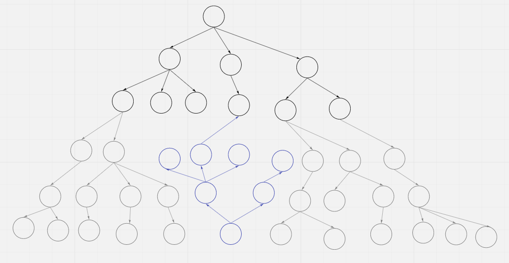

# Introduction

Bidirectional search is a graph search algorithm that finds a shortest path from an initial vertex to a goal vertex in a directed graph. It runs two simultaneous searches: one forward from the initial state, and one backward from the goal, stopping when the two meet. The reason for this approach is that in many cases it is faster: for instance, in a simplified model of search problem complexity in which both searches expand a tree with branching factor b, and the distance from start to goal is d, each of the two searches has complexity O(b^d/2^), and the sum of these two search times is much less than the O(b^d^) complexity that would result from a single search from the beginning to the goal.

Bidirectional search can be applied to one-to-one shortest path algorithms such as BFS, Dijkstra and A*. The following is an illustration on Bidirectional BFS.



The back nodes are searched from initial state and the blue nodes are searched from the goal. The grey nodes are nodes explored in the single direction BFS but avoided in the bidirectional BFS.

An example of Bidirectional BFS.

```java
/**
 * Definition for a Vertex node.
 * public class Vertex {
 *     List<Vertex> neighbors;
 *     Vertex() { this.neighbors = new ArrayList<>(); }
 *     Vertex(List<Vertex> neighbors) { this.neighbors = neighbors; }
 * }
 */
public int bidirectionalBFS(Vertex src, Vertex dest) {
    Set<Vertex> visited = new HashSet<>();
    //the following two are set up with LinkedHashSet for better iteration performance
    Set<Vertex> forward = new LinkedHashSet<>();
    Set<Vertex> backward = new LinkedHashSet<>();
    //add src and dest to the "queue" and visited set/
    forward.add(src);
    backward.add(dest);
    visited.add(src);
    visited.add(dest);
    //count the how many nodes on the path
    int res = 0;
    
    while (!forward.isEmpty()) {
        Set<Vertex> next = new LinkedHashSet<>();
        res++;
        for (Vertext cur : forward) {
            for (Vertex cand : cur.neighbors) {
                // we need check backward first because all nodes in the backward are already added in the visited set
                if (backward.contains(cand)) {
                    return res;
                }
                if (visited.add(cand)) {
                    next.add(cand);
                }
            }
        }
        // keep the small set as forward
        if (next.size() > backward.size()) {
            forward = backward;
            backward = next;
        } else {
            forward = next;
        }
    }
    return 0;
}
```

