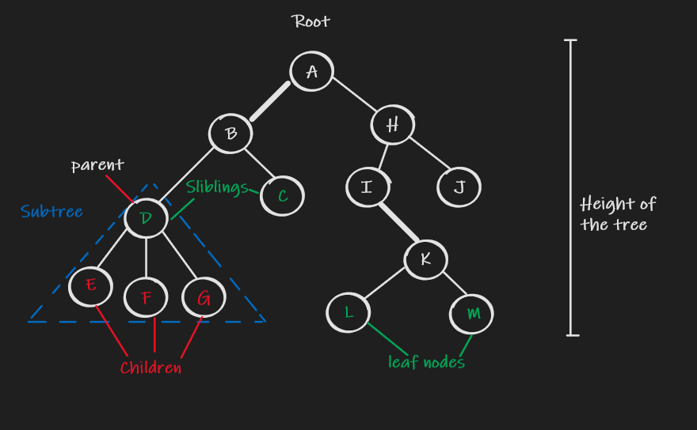

## Introduction

### Tree

A **tree** is a widely used abstract data type that simulates a hierarchical tree structure, with a root value and subtrees of children with a parent node, represented as a set of linked nodes.

* Tree only has one root and it is a connected acyclic undirected graph.

* Linked List is a kind of tree
* Tree is a subset of graph

#### Binary Tree

at most two children

#### Traverse Tree

|            | binary tree order        | General                                        |
| ---------- | ------------------------ | ---------------------------------------------- |
| Pre-order  | Parent -> Left - > Right | Parent -> Left node 1 -> Left 2 -> .. -> Right |
| In-order   | Left -> Parent-> Right   | N/A                                            |
| Post-order | Left -> Right ->Parent   | Left node 1 -> Left 2 -> .. -> Right -> Parent |

A simple way to remember them for binary tree is that the left subtree is always prior to the right. pre-, in- and post- are referring to the parent node.

#### Binary Search Tree(BST)

A binary search tree, also called an ordered or sorted binary tree, is a rooted binary tree whose internal nodes each store a key greater than all the keys in the nodes left subtree and less than those in its right subtree. A subtree of a BST is also a BST.

 

| Operations | Performance                                                  |
| ---------- | ------------------------------------------------------------ |
| Lookup     | O(log(n))                                                    |
| Insert     | O(log(n))                                                    |
| Delete     | O(log(n)) for leaf node, delete it directly.  For other nodes, replace with the largest node in the left subtree  or minimum in the right subtree. repeat until reaching the leaf node. |

 Tree Questions can usually be solved by recursion.

* The definition of Tree is recursion
* The trait of subtree follows the trait of the original tree. e.g BST, all left nodes are less than the root and all the right nodes are greater than the root.

