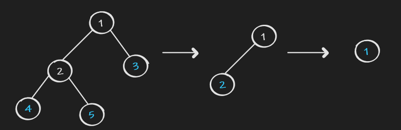

## Maximum Depth of Binary Tree

### Maximum Depth of Binary Tree

[Link](https://leetcode.com/problems/maximum-depth-of-binary-tree/)

Given the root of a binary tree, return its maximum depth.

A binary tree's maximum depth is the number of nodes along the longest path from the root node down to the farthest leaf node.

#### Solution
The max depth of a TreeNode can be found by traverse all its subpath and find record the max one. However, that is time consuming as there are 2 choices in each level.

However, it is not hard to figure out the max depth of a node only depends on the max depth in its left subtree and the max depth in its right subtree. 1 + max of the two is its max depth. In this case, all the nodes only traversed once.

```java
    public int maxDepth(TreeNode root) {
        return root == null ? 0 : 1 + Math.max(maxDepth(root.left), maxDepth(root.right));
    }
```
Time complexity: only traverse every node once => O(n)
Space complexity: if consider the recursive heap. it is O(maxDepth of the tree)

### Find Leaves of Binary Tree

[Link](https://leetcode.com/problems/find-leaves-of-binary-tree/)

Given the root of a binary tree, collect a tree's nodes as if you were doing this:

Collect all the leaf nodes.
Remove all the leaf nodes.
Repeat until the tree is empty.

#### Solution



As we can see from the process. The nodes with maxDepth 1 are collected first and those with maxDepth 2 are collected second so on and so forth. In this case, we just need to add node according to its maxDepth. Because the maxDepth grows with natural order. we just need a list with random access to find the right place to add. Also, because the first index of the list is zero, we can just start maxDepth from 0 instead of 1.

```java
    public List<List<Integer>> findLeaves(TreeNode root) {
        List<List<Integer>> res = new ArrayList<>();
        maxDepth(root, res);
        return res;
    }
    
    private int maxDepth(TreeNode cur, List<List<Integer>> res) {
        if (cur == null) {
            // the make sure the minimun deoth is zero
            return -1;
        }
        int depth = 1 + Math.max(maxDepth(cur.left, res), maxDepth(cur.right, res));
        // increase the list if necessary
        if (res.size() == depth) {
            res.add(new ArrayList<>());
        }
        res.get(depth).add(cur.val);
        return depth;
    }
```